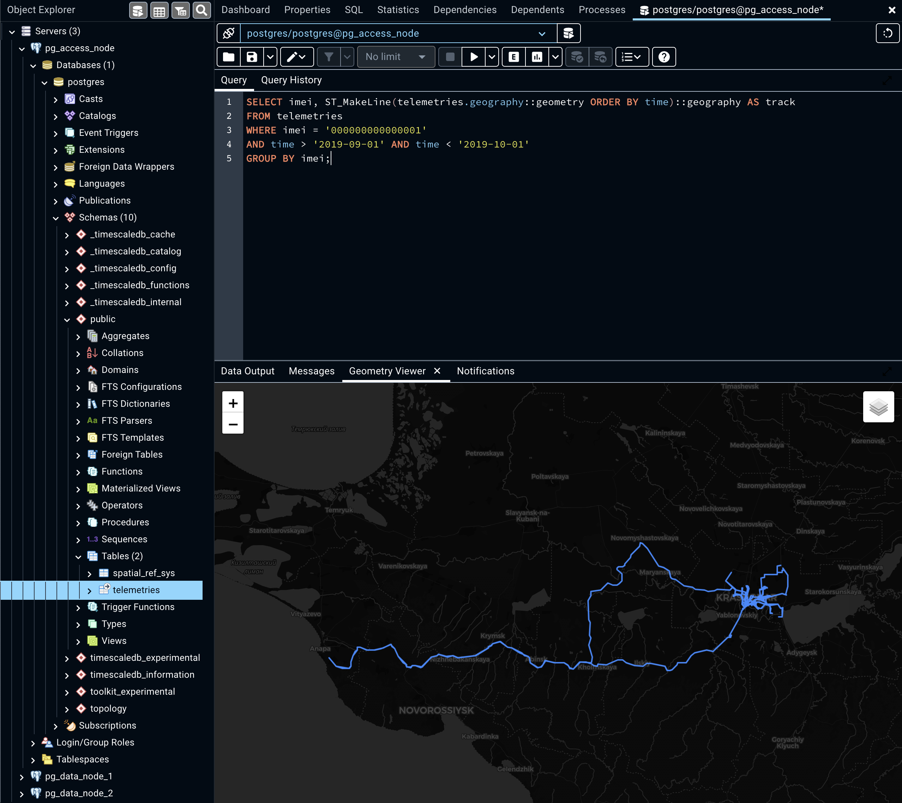
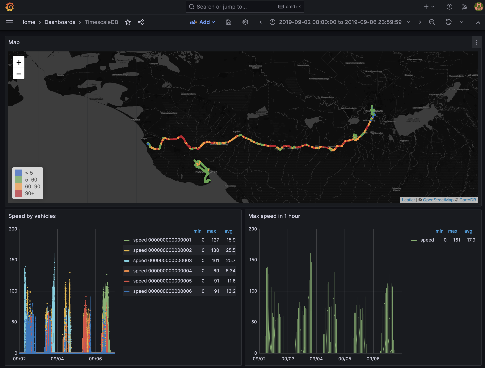

# Multi-Node-TimescaleDB

Demo project for online workshop with #RuPostgresTuesday.
Watch tons of cool and useful videos on their channel: 
[https://youtube.com/RuPostgres](https://youtube.com/RuPostgres).

Check out the first part: 
[В-s02e08 Распаковка TimescaleDB 2.0. В гостях — Иван Муратов](https://youtu.be/vbJCq9PhSR0).
If you need the same project as in the first part check out the branch: 
[PgTuesday_1_17.11.2020](https://github.com/binakot/Multi-Node-TimescaleDB/tree/PgTuesday_1_17.11.2020).

The second part is already available: 
[В-s02e09 Timescale с Иваном Муратовым. Часть 2 — ныряем глубже: сжатие и визуализация](https://youtu.be/1C2VGD90KGk).
Added corresponding branch for the video:
[PgTuesday_2_01.12.2020](https://github.com/binakot/Multi-Node-TimescaleDB/tree/PgTuesday_2_01.12.2020).

The main branch is under development and can be different from the video.





## About

A multi-node setup of TimescaleDB `2.12.1` with PostgreSQL `15` based on Docker image: 
[timescale/timescaledb-ha:pg15.4-ts2.12.1-all](https://hub.docker.com/r/timescale/timescaledb-ha).

Initial cluster configuration: 
single access node (AN) and 2 data nodes (DN) 
with interval `1 week` and replication factor `1`.

## How to run

Docker is required!

Create external network and run application stack.

```bash
$ docker network create pg_cluster_network
$ docker-compose up -d
```

`PgAdmin` is available on [http://localhost:15432](http://localhost:15432) with credentials: `admin@admin.com` / `admin`. 
`PgAdmin` can render `PostGIS` data right on the map.
Or you can use any tool you like (`psql`, `franchise`, etc) if you don't want to look at geographical beauty ;)

```text
# Access node
host: pg_access_node
port: 5432
username: postgres
password: postgres

# Data node 1
host: pg_data_node_1
port: 5433
username: postgres
password: postgres

# Data node 2
host: pg_data_node_2
port: 5434
username: postgres
password: postgres
```

## Workshop

### 1. Initialization

At this moment you should to have a running cluster with 1 access node and 2 data nodes.
If you don't please look at `how to run` section and do it firstly.
Also, you need access to all nodes via `psql`, `pgAdmin` or any other way you like.

Now you can fill sample data (took about 2 minutes on NVMe):

```bash
$ gzip -k -d ./data/*csv.gz
$ docker exec -i pg_access_node /bin/sh < ./load-init-data.sh
```

### 2. Learning cluster configuration

Run on access node and each data nodes separately:

```sql
SELECT count(*) FROM telemetries;
ANALYZE telemetries;
SELECT * FROM approximate_row_count('telemetries');
SELECT DISTINCT imei FROM telemetries ORDER BY imei;
```

### 3. Querying to cluster via access node

```sql
-- Total speed analytics for 1 year
SELECT
    time_bucket('30 days', time) AS bucket,
    imei,
    avg(speed) AS avg,
    max(speed) AS max
FROM telemetries
WHERE speed > 0
GROUP BY imei, bucket
ORDER BY imei, bucket;

-- Speed percentiles on all telemetries
SELECT 
    percentile_cont(0.50) WITHIN GROUP (ORDER BY speed) AS p50,
    percentile_cont(0.90) WITHIN GROUP (ORDER BY speed) AS p90,
    percentile_cont(0.99) WITHIN GROUP (ORDER BY speed) AS p99
FROM telemetries;

-- Single track points for 1 month
SELECT * FROM telemetries 
WHERE imei = '000000000000001'
AND time > '2019-09-01' AND time < '2019-10-01'
ORDER BY time ASC;

-- All tracks for 1 month
SELECT imei, ST_MakeLine(telemetries.geography::geometry ORDER BY time)::geography AS track
FROM telemetries
WHERE time > '2019-09-01' AND time < '2019-10-01'
GROUP BY imei;

-- All vehicle mileages for 1 month
WITH tracks AS (
    SELECT imei, ST_MakeLine(telemetries.geography::geometry ORDER BY time)::geography AS track
	FROM telemetries
	WHERE time > '2019-09-01' AND time < '2019-10-01'
	GROUP BY imei
)
SELECT imei, ST_Length(track) / 1000 AS kilometers
FROM tracks
GROUP BY imei, kilometers;
```

### 4. Add third data node to the cluster

Firstly run the third instance of postgres for new data node:

```bash
$ docker volume create pg_data_node_3_data
$ docker run -d \
    --name pg_data_node_3 \
    --restart=unless-stopped \
    -e "POSTGRES_DB=postgres" \
    -e "POSTGRES_USER=postgres" \
    -e "POSTGRES_PASSWORD=postgres" \
    -p 5435:5432 \
    --network pg_cluster_network \
    -v pg_data_node_3_data:/home/postgres/pgdata/data \
    -v `pwd`/trust-all.sh:/docker-entrypoint-initdb.d/777_trust.sh \
    -v `pwd`/unsafe-boost.sh:/docker-entrypoint-initdb.d/888_boost.sh \
    -v `pwd`//init-data-node.sh:/docker-entrypoint-initdb.d/999_cluster.sh \
    timescale/timescaledb-ha:pg15.4-ts2.12.1-all
```

Now connect a new node to the cluster running command below from the access node:

```sql
SELECT * FROM add_data_node('data_node_3', host => 'pg_data_node_3');
SELECT * FROM timescaledb_information.data_nodes;
```

Then attach new data node to the distributed hypertable:

```sql
SELECT * FROM timescaledb_information.hypertables;
SELECT * FROM timescaledb_information.dimensions;

SELECT * FROM attach_data_node('data_node_3', 'telemetries');
SELECT * FROM timescaledb_information.dimensions;
```

### 5. Add more sample data into the cluster with 3 data nodes

Fill more sample data (took about 1 minutes on NVMe):

```bash
$ docker exec -i pg_access_node /bin/sh < ./load-more-data.sh
```

Run on access node and each data nodes separately:

```sql
SELECT count(*) FROM telemetries;
ANALYZE telemetries;
SELECT * FROM approximate_row_count('telemetries');
SELECT DISTINCT imei FROM telemetries ORDER BY imei;
```

Check old and new data distribution:

```sql
SELECT data_nodes, chunk_name, range_start, range_end FROM timescaledb_information.chunks
WHERE range_start < '2020-01-01'
ORDER BY data_nodes ASC, range_start ASC;

SELECT data_nodes FROM timescaledb_information.chunks
WHERE range_start < '2020-01-01'
GROUP BY data_nodes;

SELECT data_nodes, chunk_name, range_start, range_end FROM timescaledb_information.chunks
WHERE range_start > '2020-01-01'
ORDER BY data_nodes ASC, range_start ASC;

SELECT data_nodes FROM timescaledb_information.chunks
WHERE range_start > '2020-01-01'
GROUP BY data_nodes;
```

### 6. Compression

Check current database size and compression status:

```sql
-- Compression settings on each data node
SELECT * FROM timescaledb_information.compression_settings;

-- Hypertable sizes
SELECT * FROM hypertable_detailed_size('telemetries');
SELECT node_name, pg_size_pretty(total_bytes) AS total 
FROM hypertable_detailed_size('telemetries')
ORDER BY node_name ASC;

-- Chunk sizes
SELECT * FROM chunks_detailed_size('telemetries');
SELECT node_name, chunk_name, pg_size_pretty(total_bytes) AS total
FROM chunks_detailed_size('telemetries')
ORDER BY node_name ASC, chunk_name ASC;
```

Create a dump for single chunk before compression:

```bash
$ docker exec -i pg_data_node_2 \
    pg_dump -h localhost -p 5432 -U postgres -Fp -v \
    -t _timescaledb_internal._dist_hyper_1_1_chunk postgres > ./chunk_before_compression.sql
```

Apply compression to hypertable:

```sql
ALTER TABLE telemetries SET (
    timescaledb.compress, 
    timescaledb.compress_orderby = 'time DESC', 
    timescaledb.compress_segmentby = 'imei'
);

CALL distributed_exec('SELECT add_compression_policy(''telemetries'', INTERVAL ''30 days'', if_not_exists => TRUE)');
```

Check database size after applying compression:

```sql
-- Compression settings on each data node
SELECT * FROM timescaledb_information.compression_settings;

-- Hypertable compression
SELECT * FROM hypertable_compression_stats('telemetries');
SELECT node_name, pg_size_pretty(before_compression_total_bytes) AS before, pg_size_pretty(after_compression_total_bytes) AS after 
FROM hypertable_compression_stats('telemetries')
ORDER BY node_name ASC;

-- Chunk compression
SELECT * FROM chunk_compression_stats('telemetries');
SELECT node_name, chunk_name, pg_size_pretty(before_compression_total_bytes) AS before, pg_size_pretty(after_compression_total_bytes) AS after 
FROM chunk_compression_stats('telemetries')
ORDER BY node_name ASC, chunk_name ASC;
```

Check that data is still available:

```sql
-- Single track for 1 month
SELECT imei, ST_MakeLine(telemetries.geography::geometry ORDER BY time)::geography AS track
FROM telemetries
WHERE imei = '000000000000001'
AND time > '2019-09-01' AND time < '2019-10-01'
GROUP BY imei;
```

Create a dump for single chunk after compression:

```bash
$ docker exec -i pg_data_node_2 \
    pg_dump -h localhost -p 5432 -U postgres -Fp -v \
    -t _timescaledb_internal._dist_hyper_1_1_chunk postgres > ./chunk_after_compression.sql

# Find compressed_chunk_id that corresponds to uncompressed _timescaledb_internal._dist_hyper_1_1_chunk.
$ docker exec -i pg_data_node_2 \
    psql -v ON_ERROR_STOP=1 -h localhost -p 5432 -U postgres \
    -c "SELECT compressed_chunk_id FROM _timescaledb_catalog.chunk WHERE table_name = '_dist_hyper_1_1_chunk'"

$ docker exec -i pg_data_node_2 \
    pg_dump -h localhost -p 5432 -U postgres -Fp -v \
    -t _timescaledb_internal.compress_hyper_2_185_chunk postgres > ./compressed_chunk.sql
```

Look at result sql files content.

### 7. Visualization

Run `Grafana` in docker container:

```bash
$ docker run \
    --name=grafana \
    -p 3000:3000 \
    -e "GF_INSTALL_PLUGINS=grafana-worldmap-panel" \
    -d grafana/grafana:10.1.5
```

Open it on [http://localhost:3000](http://localhost:3000)
with `admin / admin`.

Then add `TimescaleDB` as new datasource and import dashboard:

* Connections / Data Sources / Add data source / Find and select `PostgreSQL`.

* Connect to access node via docker bridge (host=`172.17.0.1`; port=`5432`; db=`postgres`; user=`postgres`; password=`postgres`; ssl=`off`).
For MacOS use `host.docker.internal:5432` for host.

* Select `PostgreSQL` version `15` and enable `TimescaleDB` support.

After that import dashboard from the file `grafana.json` (Dashboard / Import / Upload JSON file).

### N. Play with cluster and stop it after

```bash
# grafana
$ docker stop grafana
$ docker rm grafana

# 3th data node
$ docker stop pg_data_node_3
$ docker rm pg_data_node_3
$ docker volume rm pg_data_node_3_data

# cluster
$ docker-compose down --volumes

# network
$ docker network rm pg_cluster_network
```

---

## Useful links

* [TimescaleDB Blog: TimescaleDB 2.0](https://blog.timescale.com/blog/timescaledb-2-0-a-multi-node-petabyte-scale-completely-free-relational-database-for-time-series)

* [TimescaleDB Docs: Changes in TimescaleDB 2.0](https://docs.timescale.com/v2.0/release-notes/changes-in-timescaledb-2)

* [TimescaleDB Docs: Single Node vs. Multi-Node](https://docs.timescale.com/v2.0/introduction/architecture#single-node-vs-clustering)

* [TimescaleDB Docs: Set up multi-node TimescaleDB](https://docs.timescale.com/v2.0/getting-started/setup-multi-node-basic)

* [TimescaleDB Docs: Distributed Hypertables](https://docs.timescale.com/v2.0/using-timescaledb/distributed-hypertables)

* [TimescaleDB API Reference: Hypertable Management](https://docs.timescale.com/v2.0/api#hypertable-management)

* [TimescaleDB Tutorial: Scaling out TimescaleDB](https://docs.timescale.com/v2.0/tutorials/clustering)

* [TimescaleDB Tutorial: Installation via Docker](https://docs.timescale.com/v2.0/getting-started/installation/docker/installation-docker)

* [TimescaleDB DockerHub: Docker images](https://hub.docker.com/r/timescale/timescaledb)

* [TimescaleDB GitHub: Examples](https://github.com/timescale/examples)

---
